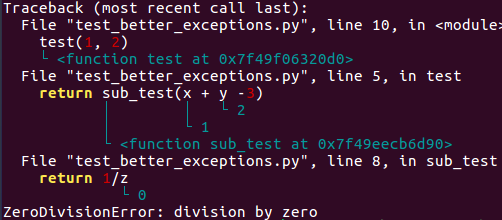

# better_exceptions

## Install

~~~ bash
pipenv shell
pip install better_exceptions
~~~

## Test code

~~~ python
import better_exceptions

def test(x, y):
    return sub_test(x + y -3)

def sub_test(z):
    return 1/z

test(1, 2)
~~~

## Call

~~~ bash
export BETTER_EXCEPTIONS=1  # Enable better_exceptions
python test_better_exceptions.py
~~~

## Result

